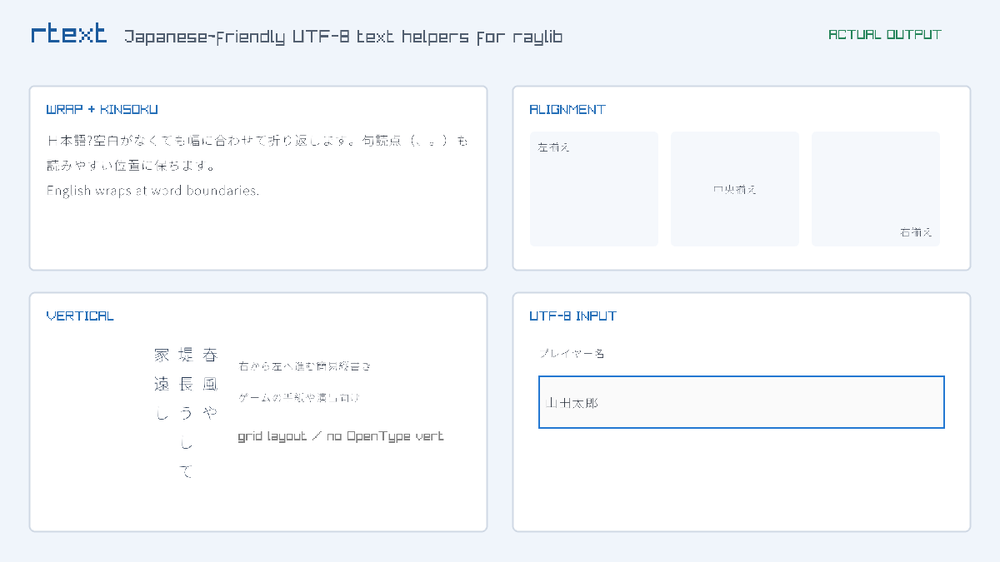
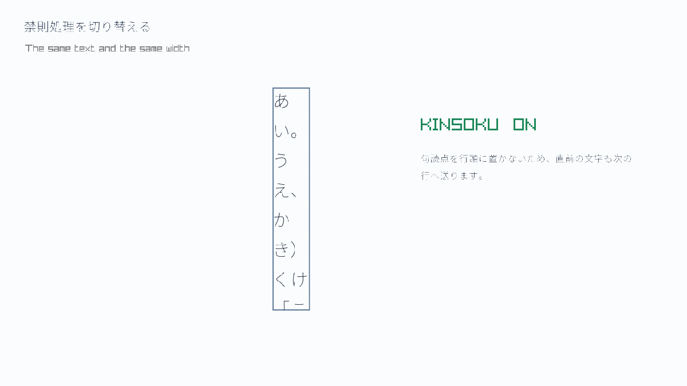

# RTextJP

<p align="center">
  <a href="README.md">English</a> · <strong>日本語</strong>
</p>

<p align="center">
  
  
  
  <a href="https://github.com/raysan5/raylib"></a>
  
  
  <a href="LICENSE"></a>
</p>

RTextJPはraylib用の非公式な日本語テキスト補助ライブラリです。このプロジェクトは公式raylib
ディストリビューションの一部ではありません。

## Windowsで、とにかく起動する

ソースを読む前に動作を見る場合は、ルートにある
[START_HERE.bat](START_HERE.bat) をダブルクリックしてください。

1. `START_HERE.bat` をダブルクリックする
2. 黒い画面のビルドが終わるまで待つ
3. メニューで `1` を入力して Enter を押す

これだけで最初の日本語exampleが開きます。`2`〜`7`もすべてウィンドウで確認できます。
エラーが起きてもランチャーは自動で閉じません。
初回だけ、CMakeが公式raylibの固定タグ `6.0` を取得するためGitとネットワーク接続が必要です。

ランチャーが作る `build-launcher` の `.exe` を直接ダブルクリックしても構いません。exampleは
次の順に日本語フォントを
自動で探します。

1. 実行時に渡されたフォントパス
2. `RTEXTJP_FONT_PATH` 環境変数
3. `examples/resources/japanese.ttf`
4. 実行ファイルから見たリポジトリ内のフォント
5. Windows標準の日本語フォント

フォントを読めなかった場合も即終了せず、原因と置き場所をウィンドウ内に表示します。

### ランチャーを使わずコマンドで起動する場合

```text
cmake -S . -B build -DRTEXTJP_FETCH_RAYLIB=ON
cmake --build build --config Debug
build\Debug\rtextjp_01_hello_japanese.exe
```

`RTextJP` は、raylibで日本語を扱いやすくするC99のシングルヘッダライブラリです。
raylib / rayguiと同じく、必要な場所でヘッダをインクルードし、1つの `.c` ファイルだけで
実装マクロを有効にします。

初版 `0.1.0` では、次の機能を提供します。

- 正しいUTF-8のデコード、エンコード、検証、文字数・バイト位置の取得
- 実際に使う日本語文字をまとめて渡すだけのフォント読み込み
- JIS X 0208のかな・非漢字・第1水準・第2水準を選べる文字集合プリセット
- 日本語の文字単位と英語の単語単位を両立した自動折り返し
- 句読点や括弧の簡易禁則処理
- 左・中央・右揃えと、上・中央・下揃え
- ゲームUI向けの簡易縦書き
- 固定長バッファで安全に扱えるUTF-8の1行入力欄
- 日本語を先に記載したDoxygenコメントとドキュメント

## 実際の出力

次の画像はモックではなく、このリポジトリの `RTextJP` とraylibで描画して自動保存した結果です。



禁則処理は同じ文章・同じ幅のまま切り替えられます。



各画面の説明と再生成方法は [実出力ギャラリー](docs/gallery_ja.md) を参照してください。

## いちばん短い使い方

まず、プロジェクトへ次の2つを追加します。

- `include/rtextjp.h`
- raylibのヘッダとライブラリ

そして、**1つの `.c` ファイルだけ**を次のようにします。

```c
#define RTEXTJP_IMPLEMENTATION
#include "rtextjp.h"

int main(void)
{
    const char *message = "こんにちは、raylib!";

    InitWindow(800, 450, "RTextJP example");
    Font font = RTextJPLoadFontFromText("japanese.ttf", 48, message);
    RTextJPStyle style = RTextJPStyleDefault(font, 32.0f, BLACK);

    while (!WindowShouldClose()) {
        BeginDrawing();
        ClearBackground(RAYWHITE);
        RTextJPDraw(message, (Vector2){ 40.0f, 40.0f }, style);
        EndDrawing();
    }

    UnloadFont(font);
    CloseWindow();
    return 0;
}
```

ほかの `.c` ファイルでは、マクロを定義せずに読み込みます。

```c
#include "rtextjp.h"
```

すべてを1つの翻訳単位内だけで使いたい場合は、`RTEXTJP_STATIC` も定義できます。

```c
#define RTEXTJP_STATIC
#define RTEXTJP_IMPLEMENTATION
#include "rtextjp.h"
```

## 日本語フォントについて

raylibの標準フォントには日本語グリフがありません。TTFまたはOTFフォントを用意し、
表示する文字を `RTextJPLoadFontFromText()` の第3引数へまとめて渡してください。
ASCIIの表示可能文字はRTextJPが自動追加します。

```c
const char *screenText =
    "設定を保存しますか？"
    "はい"
    "いいえ"
    "Settings are saved.";

Font font = RTextJPLoadFontFromText("japanese.ttf", 48, screenText);
```

この方式は、2万字を超えるCJK統合漢字を無条件で巨大なアトラスへ詰めず、ゲームで使う文字だけを
軽量に読み込むための設計です。あとから表示する文字や、入力される可能性のある文字も忘れずに
第3引数へ含めてください。含めていない文字は代替グリフになります。

自由入力などで事前に全文字を列挙できない場合は、JIS文字集合を列挙型で選び、固有名詞などを
追加できます。

```c
RTextJPCharacterSet set = (RTextJPCharacterSet)(
    RTEXTJP_CHARACTER_SET_JIS_X_0208_NON_KANJI |
    RTEXTJP_CHARACTER_SET_JIS_X_0208_LEVEL_1);

int requestedGlyphs = RTextJPCharacterSetCodepointCount(set, "髙島");
Font font = RTextJPLoadFontFromCharacterSet("japanese.ttf", 32, set, "髙島");
```

第1水準・第2水準は漢字だけの集合です。普通の日本語文を広く扱うなら、上のように
`NON_KANJI` と組み合わせます。収録数と選び方は [日本語文字集合プリセット](docs/character_sets_ja.md)
にまとめています。

フォントファイルのライセンスは各フォントに従います。ソースリポジトリはフォント本体をコミット
しません。ローカルの `examples/resources/japanese.ttf` は `.gitignore` 対象です。Noto Sans JPを
使う場合のOFLと配布READMEは同じディレクトリにあります。後述のWindowsデモZIPには、これらの
ライセンス文書と一緒にフォントを収録できます。

## example集

各exampleは単独の `.c` ファイルで、上から順に読む構成です。

| example | 学べること |
|---|---|
| `01_hello_japanese.c` | 最小構成、フォント読み込み、通常描画 |
| `02_text_box.c` | 日本語と英語の折り返し、禁則処理 |
| `03_alignment.c` | 横揃え・縦揃えとサイズ測定 |
| `04_vertical_writing.c` | 右から左へ進む簡易縦書き |
| `05_text_input.c` | 固定バッファ入力、クリック、貼り付け |
| `06_utf8_tools.c` | UTF-8をコードポイント単位で確認するGUIビューア |
| `07_character_sets.c` | JIS文字集合プリセットの選択、文字数、カスタム追加 |

通常はフォントを自動検出します。明示的に指定したい場合は、フォントを
`examples/resources/japanese.ttf` に置くか、実行時の第1引数でパスを渡します。

```text
rtextjp_01_hello_japanese C:/fonts/MyJapaneseFont.ttf
```

詳しい順番は [examples/README.md](examples/README.md) を参照してください。

## CMake開発環境

RTextJPはraylibバイナリをソースリポジトリへ同梱しません。開発用の共有presetは公式raylib `6.0`の
FetchContent fallbackを有効にしますが、インストール済みraylibがあればそちらを優先します。初回の
fallback configureにはGitとネットワーク接続が必要で、以降はCMakeのキャッシュを利用します。

### Visual Studio 2022 / MSVCの通常開発

Visual Studio用presetに必要なのは、CMakeとVisual Studio 2022のC++ワークロードです。64-bit MSVCを
使用し、NinjaやLLVMは不要です。最初にconfigureし、build presetで構成を選びます。

```text
cmake --preset vs2022
cmake --build --preset vs2022-debug
```

最適化したビルドは次のコマンドです。

```text
cmake --build --preset vs2022-release
```

`vs2022`はexampleを有効にし、Visual Studio solutionを `build-vs2022/` に生成します。Visual Studioは
マルチコンフィグgeneratorなので、configure presetでは `CMAKE_BUILD_TYPE`を設定しません。
メニュー形式で起動する既存の `START_HERE.bat` も引き続き利用できます。

### Visual Studio 2022 / MSVCでテスト

テスト用presetは別のビルドディレクトリを使用し、exampleを無効、テストを有効にします。

```text
cmake --preset vs2022-tests
cmake --build --preset vs2022-tests-debug
ctest --preset vs2022-tests-debug
```

### Ninja・clangd・Zedの補完

Visual Studio generatorは `compile_commands.json`を生成しません。NinjaとCコンパイラを利用できる
開発者は、補完専用ディレクトリへコンパイルデータベースを生成できます。

```text
cmake --preset clangd
```

WindowsでNinjaからMSVCを使う場合は、**x64 Native Tools Command Prompt for VS 2022**で実行します。
このpresetは `CMAKE_C_COMPILER`、`CMAKE_MAKE_PROGRAM`、LLVMの場所など、環境固有の絶対パスを
固定しません。exampleとテストを有効にし、補完に必須ではないdocs galleryは無効のままにします。

コマンドは `build-clangd/compile_commands.json`を生成します。補完だけならビルドは不要です。
リポジトリの `.clangd`は相対パスでこのディレクトリを参照し、Zed標準のCサポートはclangdを
使用します。ソース、CMakeオプション、toolchainの変更後は再configureしてください。Zedを既に
開いていた場合は、コマンドパレットから `editor: restart language server`を一度実行します。

コンパイルデータベースには、生成したPCの絶対パスが含まれます。そのため `build-clangd/`と
ルート直下の `compile_commands.json`はGitの無視対象であり、コミットしません。

### ローカルのコンパイラ・Ninjaパス

`CMakeUserPresets.json`はGitの無視対象で、環境固有の上書きに使用します。Ninjaやコンパイラが
`PATH`にない場合は、`clangd`を継承する `clangd-local`などのローカルpresetを作り、そこで
`CMAKE_MAKE_PROGRAM`や `CMAKE_C_COMPILER`を指定して、そのローカルpresetを実行してください。
これらのパスは `CMakePresets.json`や `.clangd`へ追加しません。

### その他のgenerator

ほかのプラットフォームでは、通常のgeneratorを選ぶかCMakeの既定値を使用できます。

```text
cmake -S . -B build -DRTEXTJP_BUILD_EXAMPLES=ON -DRTEXTJP_FETCH_RAYLIB=ON
cmake --build build
```

ライブラリとして組み込むだけなら、`include/`とraylibのincludeパスをコンパイラへ追加するだけです。

## WindowsデモZIP

ソースリポジトリと配布用バイナリを分けたまま、次のRelease用ZIPを作成できます。

```text
RTextJP-demo-windows.zip
├── rtextjp_01_hello_japanese.exe
├── raylib.dll
├── japanese.ttf
├── README.md
├── README_ja.md
├── README-font.txt
├── LICENSE-RTextJP.txt
├── LICENSE-raylib.txt
└── LICENSE-font.txt
```

`examples/resources/japanese.ttf` にNoto Sans JPを置いたWindows開発者コマンドプロンプトで実行します。

```text
cmake -S . -B build-demo -G "NMake Makefiles" -DRTEXTJP_BUILD_EXAMPLES=ON -DRTEXTJP_FETCH_RAYLIB=ON -DRTEXTJP_BUILD_DEMO_PACKAGE=ON -DBUILD_SHARED_LIBS=ON
cmake --build build-demo --target rtextjp_demo_archive
```

出力先は `build-demo/packages/RTextJP-demo-windows.zip` です。raylibとフォントのライセンスは
自動的にZIPへコピーされます。

## ドキュメント

- [最初の10分](docs/quickstart_ja.md)
- [APIの選び方](docs/api_ja.md)
- [日本語文字集合プリセット](docs/character_sets_ja.md)
- [実出力ギャラリー](docs/gallery_ja.md)
- [設計方針と制約](docs/design_ja.md)
- [日本語入力とIME](docs/ime_ja.md)

Doxygenがインストール済みなら、ルートディレクトリで次を実行すると `build/docs/html/` に
HTMLリファレンスを生成できます。

```text
doxygen Doxyfile
```

## ライセンス

RTextJPは [MIT License](LICENSE) で公開します。Copyright © 2026 LuisR385.

raylibと任意のフォントには、それぞれのライセンスが適用されます。詳細は
[Third-party notices](THIRD_PARTY_NOTICES.md) と各配布物に含まれるライセンス文書を参照してください。

## 現在の制約

- C99とraylib 6.0以降を対象にしています。
- 禁則処理はゲームUI向けの簡易版で、JIS X 4051の完全な組版エンジンではありません。
- 縦書きは文字をマス目状に配置します。縦書き専用字形やラテン文字の回転は行いません。
- IMEの未確定文字列や候補ウィンドウは描画しません。確定文字の受け取り可否はraylibの
  プラットフォームバックエンドに依存します。
- 文字集合プリセットはフォントへグリフを要求する範囲です。使用するフォント自体にない文字は
  読み込めないため、`Font.glyphCount` が要求数より少なくなる場合があります。
- 複数のシザーモードは入れ子にしないでください。外側で使う場合は `style.clip = false` にします。
