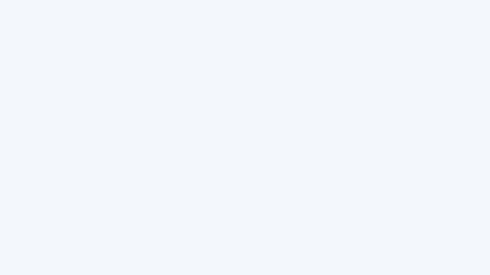

# 実出力ギャラリー

このページの画像は、`tools/capture_gallery.c` が実際の `RTextJP` APIを呼び、raylibの描画結果を
PNGへ保存したものです。レイアウトを説明するためのモック画像ではありません。

## 一覧


- 左上: 日本語の文字間・英語の単語境界を使う自動折り返しと簡易禁則
- 右上: 左上・中央・右下の横/縦揃え
- 左下: 右から左へ進む簡易縦書き
- 右下: 固定長UTF-8バッファの1行入力欄

## 禁則処理のON/OFF


ONでは句読点を行頭へ残さないため、直前の文字も次の行へ送ります。OFFでは幅だけで折り返すため、
`。` や `、` が行頭へ来る場合があります。GIFの入力文字列、幅、フォントサイズは同一です。

## 文字集合プリセット



右端は `RTextJPCharacterSetCodepointCount()` の結果です。最下部の `requested` と `font provided` の差は、
指定したフォントに存在しないグリフがあることを示します。詳細は
[日本語文字集合プリセット](character_sets_ja.md) を参照してください。

## 自分のフォントで再生成する

WindowsのVisual Studioジェネレーターでは、ルートディレクトリから次を実行します。

```text
cmake -S . -B build -DRTEXTJP_BUILD_DOCS_GALLERY=ON -DRTEXTJP_FETCH_RAYLIB=ON
cmake --build build --config Debug --target rtextjp_capture_gallery
build\Debug\rtextjp_capture_gallery.exe examples\resources\japanese.ttf docs\assets
python tools\make_kinsoku_gif.py docs\assets
```

単一構成ジェネレーターでは、実行ファイルが `build/rtextjp_capture_gallery` に作られる場合があります。
第1引数は任意の日本語TTF/OTF、第2引数は既存の出力ディレクトリです。画像生成にはOpenGLコンテキストを
作れるデスクトップ環境が必要です。ウィンドウは `FLAG_WINDOW_HIDDEN` で非表示にされます。

画像の生成に使ったローカルフォントは Noto Sans JP です。フォント本体はリポジトリへ含めず、
生成済み画像だけを `docs/assets/` に置いています。
